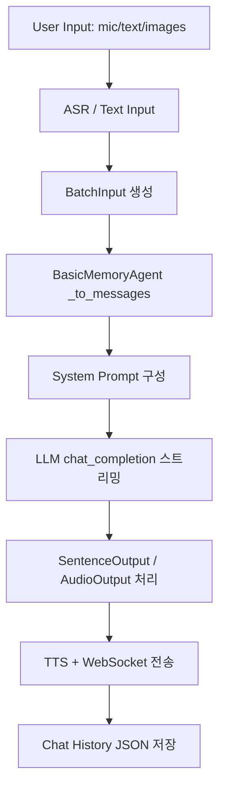

## CONTEXT_MANAGEMENT.md — 대화 컨텍스트 관리 조사

조사 대상: Open-LLM-VTuber (Python 백엔드)  
목표: **LLM 대화 컨텍스트 구성 방식** 및 **메모리/로그 구조** 파악

---

## 1) 코드 레벨 트리 (키워드 기준)

`memory/history/context/conversation` 관련 핵심 파일 요약:

- `src/open_llm_vtuber/agent/agents/basic_memory_agent.py`  
  - 역할: LLM 호출 직전 **messages 구성**, 메모리 저장, 인터럽트 처리  
  - 함수: `_to_messages()`, `_add_message()`, `set_memory_from_history()`
  - 핵심: 내부 `_memory`를 그대로 messages에 포함

- `src/open_llm_vtuber/service_context.py`  
  - 역할: 시스템 프롬프트 구성, 에이전트 초기화  
  - 함수: `construct_system_prompt()`, `init_agent()`

- `src/open_llm_vtuber/conversations/*`  
  - 역할: 사용자 입력 처리 → 에이전트 호출 → 출력 처리  
  - 함수: `process_single_conversation()`, `handle_conversation_trigger()`

- `src/open_llm_vtuber/chat_history_manager.py`  
  - 역할: 대화 로그 JSON 저장/로드  
  - 함수: `create_new_history()`, `get_history()`, `store_message()`

- `src/open_llm_vtuber/agent/stateless_llm/*`  
  - 역할: LLM API 호출 (stateless), 시스템 프롬프트 + messages 사용

- `src/open_llm_vtuber/agent/agents/mem0_llm.py`  
  - 역할: Mem0 기반 장기 메모리 (파일은 비어 있음 → 미구현)

---

## 2) 컨텍스트 구성 로직 (모델 호출 직전)

| 항목 | 구현 위치 | 동작 방식 |
|---|---|---|
| messages 배열 생성 | `BasicMemoryAgent._to_messages()` | 내부 `_memory` 복사 + 이번 입력(user) 추가 |
| system prompt 정의 | `ServiceContext.construct_system_prompt()` | `persona_prompt` + tool prompts 합성 |
| 이전 대화 몇 턴 포함 | `BasicMemoryAgent._memory` 전체 | **전체 누적** (명시적 슬라이딩 없음) |
| 파일/설정 기반 메모리 | `get_history()` → `set_memory_from_history()` | 선택된 history를 `_memory`로 로드 |
| 유저/VTuber 설정 포함 | `persona_prompt`, `tool_prompts`, `character_config.*` | system prompt에 포함 |

### 핵심 코드 근거
messages 구성 (누적 메모리 + 현재 입력):
```242:288:src/open_llm_vtuber/agent/agents/basic_memory_agent.py
    def _to_messages(self, input_data: BatchInput) -> List[Dict[str, Any]]:
        """Prepare messages for LLM API call."""
        messages = self._memory.copy()
        user_content = []
        text_prompt = self._to_text_prompt(input_data)
        if text_prompt:
            user_content.append({"type": "text", "text": text_prompt})
        ...
        if user_content:
            user_message = {"role": "user", "content": user_content}
            messages.append(user_message)
```

system prompt 구성 (persona + tool prompts):
```436:459:src/open_llm_vtuber/service_context.py
    async def construct_system_prompt(self, persona_prompt: str) -> str:
        """
        Append tool prompts to persona prompt.
        """
        logger.debug(f"constructing persona_prompt: '''{persona_prompt}'''")

        for prompt_name, prompt_file in self.system_config.tool_prompts.items():
            if (
                prompt_name == "group_conversation_prompt"
                or prompt_name == "proactive_speak_prompt"
            ):
                continue
            prompt_content = prompt_loader.load_util(prompt_file)
```

history → memory 로드:
```176:193:src/open_llm_vtuber/agent/agents/basic_memory_agent.py
    def set_memory_from_history(self, conf_uid: str, history_uid: str) -> None:
        """Load memory from chat history."""
        messages = get_history(conf_uid, history_uid)

        self._memory = []
        for msg in messages:
            role = "user" if msg["role"] == "human" else "assistant"
            content = msg["content"]
            if isinstance(content, str) and content:
                self._memory.append(
                    {
                        "role": role,
                        "content": content,
                    }
                )
```

---

## 3) 메모리/로그 저장 구조

### 저장소
- **파일(JSON)**: `chat_history/<conf_uid>/<history_uid>.json`  
  - `create_new_history()`로 생성 후 메시지 append 저장

### 세션 단위
- `conf_uid` 기준으로 폴더 분리 → **캐릭터/설정 단위** 세션 관리

### 근거 코드
```63:90:src/open_llm_vtuber/chat_history_manager.py
def create_new_history(conf_uid: str) -> str:
    """Create a new history file with a unique ID and return the history_uid"""
    ...
    conf_dir = _ensure_conf_dir(conf_uid)
    filepath = os.path.join(conf_dir, f"{history_uid}.json")
    initial_data = [
        {
            "role": "metadata",
            "timestamp": datetime.now().isoformat(timespec="seconds"),
        }
    ]
    with open(filepath, "w", encoding="utf-8") as f:
        json.dump(initial_data, f, ensure_ascii=False, indent=2)
```

---

## 4) 컨텍스트 초과 처리 방식

명시적 토큰 제한/슬라이딩/요약 로직 **없음**.  
`BasicMemoryAgent._memory`에 누적된 전체 메시지를 그대로 사용합니다.  

> 따라서 **LLM 컨텍스트 길이 초과는 현재 별도 처리 없이 실패할 가능성**이 큽니다.

---

## 5) “가상 메모리” 구조 여부

**없음.**  
요약/장기 메모리/슬라이딩 윈도우 등 “가상 메모리” 파이프라인이 보이지 않음.  

분류: **단순 누적 메모리 기반** (최근 대화만 따로 슬라이딩하지 않음)

---

## 6) 실시간 스트리밍 vs 배치

- LLM 응답: **스트리밍**  
  - `StatelessLLMInterface.chat_completion()`은 AsyncIterator로 토큰 스트림
- TTS 출력: **문장 단위 분할 → 부분 전송**
- 최종 응답 후 `backend-synth-complete` 전송

---

## 7) 전체 구조 다이어그램 (Mermaid)



---

## 8) 최종 결론

### 메모리 아키텍처 유형 (택 1)
**None** (단순 누적 메모리, 슬라이딩/요약/RAG 없음)

### 컨텍스트 관리 수준
**낮음**  
- 누적 저장/불러오기만 존재  
- 초과 처리 로직 없음  
- 요약/검색/가상 메모리 없음

### IDE 코파일럿류 구조와 비교
- IDE 코파일럿은 보통 **슬라이딩/요약/선택적 컨텍스트**를 적용  
- 본 프로젝트는 **전체 누적 기반**이라 길이 제한에 취약

---

## 추가 메모

- `mem0_agent` 설정은 있으나 실제 구현 파일 `mem0_llm.py`는 비어 있음 → 장기 메모리 미구현
