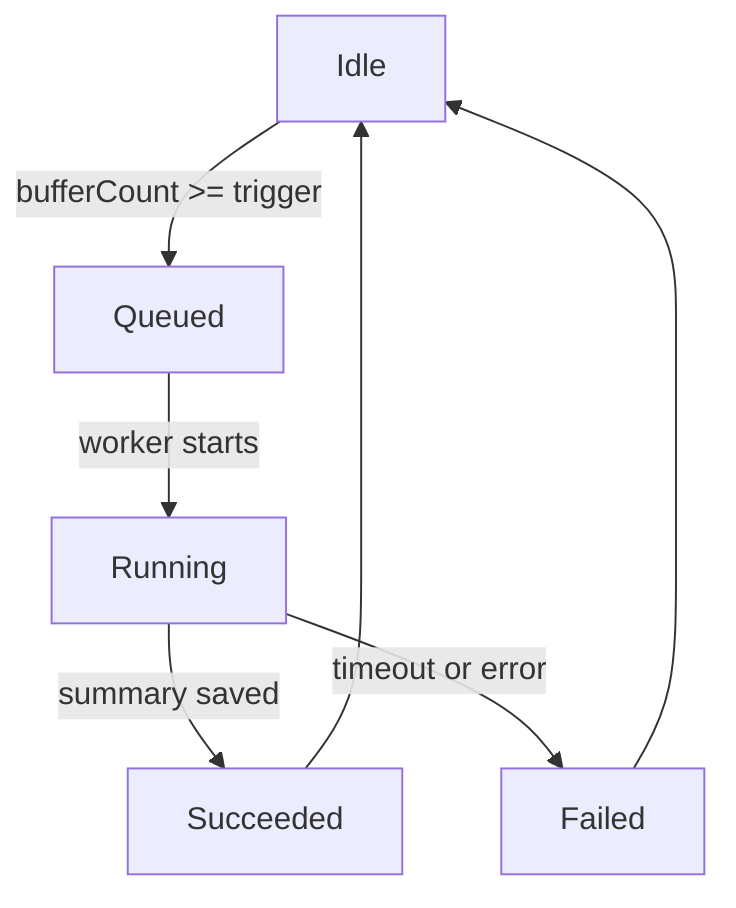
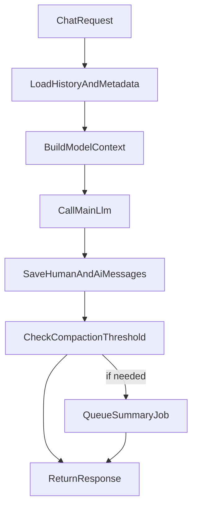

# CONTEXT_SUMMARIZATION_IMPLEMENTATION_PLAN.md

## 목적

이 문서는 다음 전제를 기준으로, 차기 단계의 컨텍스트 요약(summary) 구조를 설계한다.

- `recent window only` MVP는 이미 적용됨
- 앞으로는 `message_index`와 `summary_upto_index`를 기준으로
  - 오래된 대화는 summary로 접고
  - 최신 대화는 원문 그대로 유지하는
  - `summary + live buffer` 구조로 확장할 예정

이번 문서의 목표는 구현이 아니라, **metadata 구조 / 상태 머신 / `llm_server` 플로우 / 동적 threshold 정책**을 먼저 명확히 정리하는 것이다.

---

## 1. 핵심 방향

### 1-1) 채택 방향

채택할 방식은 다음과 같다.

- 각 메시지에 `message_index`를 저장
- history `metadata`에 `summary_upto_index`를 저장
- 모델 입력은 항상:
  - `system/persona/tool prompts`
  - `stored summary`
  - `summary_upto_index` 이후의 recent raw messages
  - 이번 사용자 입력

즉, 원문 history는 유지하고, 모델 입력만 점진적으로 경량화한다.

### 1-2) 목표 UX

- 대화 중 summary 때문에 응답이 막히지 않아야 한다
- summary 생성이 늦어도 기존 recent buffer로 계속 대화 가능해야 한다
- summary 실패 시에도 서비스는 정상 동작해야 한다
- 설정값(`max/target/trigger`)은 QA 중 변경 가능해야 한다

---

## 2. Threshold 정책

## 2-1) 세 값의 의미

- `maxMessageCount`
  - live buffer가 절대로 넘기지 않길 원하는 상한
- `targetMessageCount`
  - summary 완료 후 다시 돌아오고 싶은 안정 구간
- `triggerMessageCount`
  - summary 작업을 시작하는 기준

예시:

- `target = 24`
- `trigger = 28`
- `max = 32`

### 2-2) 권장 관계식

항상 아래 관계를 강제하는 것이 좋다.

- `0 < target < trigger <= max`

추가 권장:

- `trigger - target >= 2`
- `max - trigger >= 2`

이유:

- summary 생성 지연 중에도 완충 구간이 필요함
- trigger 직후 곧바로 max를 찍지 않도록 해야 함

### 2-3) 왜 동적으로 바꿀 수 있어야 하나

실제 QA에서 다음 변수들이 달라질 수 있다.

- 평균 발화 길이
- 모델 컨텍스트 크기
- 응답 지연 허용치
- summary 품질
- summary 생성 비용

따라서 이 값들은 하드코딩보다 설정값으로 두는 것이 맞다.

---

## 3. 설정 구조 제안

## 3-1) 설정 위치

기존 구조와 가장 잘 맞는 위치는 `basic_memory_agent` 하위다.

제안 경로:

- `character_config.agent_config.agent_settings.basic_memory_agent.context_compaction`

예시:

```yaml
character_config:
  agent_config:
    agent_settings:
      basic_memory_agent:
        llm_provider: "gemini_llm"
        faster_first_response: true
        segment_method: "pysbd"
        use_mcpp: false
        mcp_enabled_servers: []
        context_compaction:
          enabled: true
          mode: "summary_recent_window"
          target_message_count: 24
          trigger_message_count: 28
          max_message_count: 32
          min_messages_to_compact: 4
          summarizer: "same_llm"
          summarizer_model: null
          summarizer_timeout_sec: 15
```

### 3-2) 필드 의미

- `enabled`
  - compaction 기능 on/off
- `mode`
  - `"recent_window_only"` 또는 `"summary_recent_window"`
- `target_message_count`
  - summary 완료 후 남길 raw message 수
- `trigger_message_count`
  - summary 시작 기준
- `max_message_count`
  - 요약 지연 중 live buffer 상한
- `min_messages_to_compact`
  - 너무 적은 메시지는 summary하지 않도록 하는 최소 단위
- `summarizer`
  - 요약 생성 방식
- `summarizer_model`
  - 별도 요약 모델을 쓸 경우 지정
- `summarizer_timeout_sec`
  - summary 요청 제한 시간

### 3-3) Reload 정책

이 값들은 `llm_server` 기준으로는 **다음 요청부터 적용** 가능하게 두는 것이 적절하다.

즉 향후 `reload-config`에서 runtime 반영 가능 항목으로 취급 가능하다.

---

## 4. History 저장 구조 제안

## 4-1) 메시지 레코드

기존 history 메시지에 `message_index`를 추가한다.

예시:

```json
{
  "role": "human",
  "timestamp": "2026-03-19T12:00:00",
  "content": "안녕",
  "message_index": 1,
  "name": "User"
}
```

```json
{
  "role": "ai",
  "timestamp": "2026-03-19T12:00:03",
  "content": "안녕하세요.",
  "message_index": 2,
  "name": "Assistant",
  "avatar": ""
}
```

### 4-2) Metadata 레코드

첫 번째 `metadata` 레코드에 summary 상태를 같이 둔다.

예시:

```json
{
  "role": "metadata",
  "timestamp": "2026-03-19T12:00:00",
  "next_message_index": 33,
  "summary": {
    "text": "요약된 장기 대화 내용...",
    "summary_upto_index": 8,
    "updated_at": "2026-03-19T12:10:00",
    "source_message_range": {
      "start": 1,
      "end": 8
    },
    "persona_hash": "abc123",
    "version": 1
  },
  "summary_job": {
    "status": "idle",
    "requested_at": null,
    "started_at": null,
    "finished_at": null,
    "last_error": null,
    "pending_from_index": null,
    "pending_to_index": null
  }
}
```

---

## 5. Metadata 필드 구조 제안

### 5-1) 루트 metadata 필드

- `next_message_index`
  - 다음 저장 메시지의 index
- `summary`
  - 현재 유효 summary 본문과 커버 범위
- `summary_job`
  - 현재 또는 마지막 summary 작업 상태

### 5-2) `summary` 필드

- `text`
  - 현재 유효 summary
- `summary_upto_index`
  - 이 index 이하 메시지는 summary에 반영되었음을 의미
- `updated_at`
  - 마지막 summary 완료 시간
- `source_message_range.start`
  - 이번 summary가 시작한 원문 구간
- `source_message_range.end`
  - 이번 summary가 끝난 원문 구간
- `persona_hash`
  - persona/config 변경 감지용
- `version`
  - summary 포맷 버전

### 5-3) `summary_job` 필드

- `status`
  - `idle`, `queued`, `running`, `succeeded`, `failed`
- `requested_at`
- `started_at`
- `finished_at`
- `last_error`
- `pending_from_index`
- `pending_to_index`

---

## 6. Summary 상태 머신

다음 상태 머신을 권장한다.



### 6-1) 상태별 의미

- `idle`
  - summary 작업 없음
- `queued`
  - summary 필요성은 판단됐지만 아직 시작 안 함
- `running`
  - summary 생성 중
- `succeeded`
  - 새 summary 저장 완료
- `failed`
  - 이번 round 실패

### 6-2) 중요한 제약

- 동일 `history_uid`에 대해 동시에 하나의 summary job만 허용
- 새 요청이 와도 이미 `queued/running`이면 중복 요청하지 않음
- 실패해도 대화 서비스는 중단하지 않음

---

## 7. Summary 생성 규칙

## 7-1) 어떤 메시지를 summary에 접을 것인가

기본 원칙:

- 항상 최신 `target_message_count`는 raw 유지
- 그보다 오래된 메시지 중 아직 summary에 안 들어간 구간만 새로 summary에 접기

계산:

- 전체 raw message 개수 = `buffer_count`
- `buffer_count < trigger`: 아무것도 하지 않음
- `buffer_count >= trigger`: `buffer_count - target` 만큼의 가장 오래된 미요약 구간을 접기 후보로 삼음

예시:

- `target=24`, `trigger=28`, `max=32`
- 현재 raw live buffer가 28개면
  - 가장 오래된 4개를 summary 대상 후보로 선택
- 현재 raw live buffer가 32개면
  - 가장 오래된 8개를 summary 대상 후보로 선택

### 7-2) 어떤 입력으로 summary를 만들 것인가

새 summary 요청에는 다음을 보낸다.

- 기존 `summary.text`가 있으면 포함
- 이번에 새로 접을 원문 메시지 구간 포함
- persona 요약 지침 포함

요약 요청의 개념 예시:

- `existing_summary + newly_compacted_messages -> new_summary`

즉, summary는 매번 처음부터 다시 만드는 것이 아니라 **증분 fold-in** 방식으로 갱신한다.

---

## 8. `llm_server` 요청 플로우 제안



### 8-1) 상세 단계

1. history와 metadata 로드
2. `summary.text`와 `summary_upto_index` 확인
3. `summary_upto_index` 이후 raw messages만 가져옴
4. 모델 입력 구성:
   - system/persona/tool prompts
   - `summary.text`가 있으면 summary block
   - raw recent messages
   - 이번 user input
5. 메인 응답 생성
6. `human`, `ai` 메시지를 history에 저장
7. `buffer_count >= trigger`면 summary job를 `queued`
8. 응답 반환

### 8-2) 왜 응답 후에 summary를 시작하나

- 사용자 응답 latency에 영향 주지 않기 위해
- summary 실패가 메인 대화 실패가 되지 않게 하기 위해
- 메인 대화와 summary API 비용을 분리하기 위해

---

## 9. Summary Worker 플로우

### 9-1) Worker 입력

- `conf_uid`
- `history_uid`
- 현재 metadata snapshot
- 현재 persona hash
- `pending_from_index`
- `pending_to_index`

### 9-2) Worker 처리

1. metadata를 다시 읽어 이미 다른 worker가 완료했는지 확인
2. `status=running`으로 변경
3. 대상 메시지 구간 추출
4. `existing_summary + target_messages`로 새 summary 요청
5. 성공 시:
   - `summary.text` 갱신
   - `summary_upto_index` 갱신
   - `summary_job.status = succeeded`
6. 실패 시:
   - `summary_job.status = failed`
   - `last_error` 저장

### 9-3) 중요한 안전장치

- summary 완료 전에 메인 요청은 기존 summary + 현재 raw buffer를 계속 사용
- summary 성공 후부터만 새 `summary_upto_index`를 반영
- 요약 중간 상태는 메인 입력 계산에 사용하지 않음

---

## 10. 모델 입력 구성 규칙

## 10-1) 요약이 없는 경우

- system/persona/tool prompts
- raw recent messages
- current user input

## 10-2) 요약이 있는 경우

- system/persona/tool prompts
- summary block
- `summary_upto_index` 이후 raw messages
- current user input

### 10-3) summary block 형태

권장:

- system prompt에 직접 병합하지 말고
- 별도의 synthetic message block으로 넣는 편이 안전하다

예시:

```python
{
    "role": "system",
    "content": "Conversation summary so far:\\n- User prefers short answers...\\n- The assistant promised to explain setup steps..."
}
```

또는:

```python
{
    "role": "assistant",
    "content": "[ConversationSummary]\\n..."
}
```

권장안은 첫 번째다.

이유:

- summary가 원문 대화와 구분된다
- 이후 디버깅과 DTO 노출이 쉽다
- persona/system과 함께 상단에 고정 배치 가능하다

---

## 11. Persona 변경 대응

summary는 persona 변경에 민감하다.

따라서 metadata에 `persona_hash`를 넣고, 다음 정책을 추천한다.

- 현재 persona hash와 summary의 `persona_hash`가 같으면 summary 사용
- 다르면 summary를 stale로 판단
- stale summary는:
  - 즉시 버리거나
  - 별도 상태로 표시하고 새 summary 생성 전까지 raw recent만 사용

권장안:

- hash가 다르면 기존 summary는 모델 입력에서 제외
- 이후 새 summary를 다시 생성

---

## 12. Admin / Unity 관점 노출 항목

향후 `GET /admin/current-config` 또는 별도 admin DTO에 다음이 있으면 좋다.

- `contextCompaction.enabled`
- `contextCompaction.mode`
- `contextCompaction.targetMessageCount`
- `contextCompaction.triggerMessageCount`
- `contextCompaction.maxMessageCount`
- `contextCompaction.summarizer`

추가 상태 조회용으로는 추후 별도 endpoint도 가능하다.

- `GET /admin/history-summary-status?history_uid=...`

응답 예:

- `summaryUptoIndex`
- `bufferCount`
- `jobStatus`
- `lastUpdatedAt`
- `lastError`

---

## 13. 구현 우선순위 제안

### Phase 1

- `message_index`
- `next_message_index`
- `summary_upto_index`
- `summary.text`
- 동적 `target/trigger/max`
- 메인 요청과 분리된 summary queue

### Phase 2

- `persona_hash`
- stale summary invalidation
- admin status 조회
- failure backoff

### Phase 3

- token 기반 threshold 보조 정책
- 별도 summarizer model 지원
- summary 품질 향상용 structured format

---

## 14. 추천 결론

현재 프로젝트와 Unity용 `llm_server` 기준으로 가장 현실적인 구조는 다음이다.

- raw history는 계속 저장
- 각 메시지에 `message_index` 부여
- metadata에 `summary_upto_index`와 `summary.text` 저장
- 모델 입력은 `summary + raw recent buffer`
- summary는 응답 후 백그라운드 증분 갱신
- `target/trigger/max`는 설정값으로 노출

즉, 구현 목표는  
**"실시간 응답은 최근 raw 대화로 유지하고, 오래된 구간은 배경에서 점진적으로 summary에 접어 넣는 구조"** 로 잡는 것이 적절하다.
